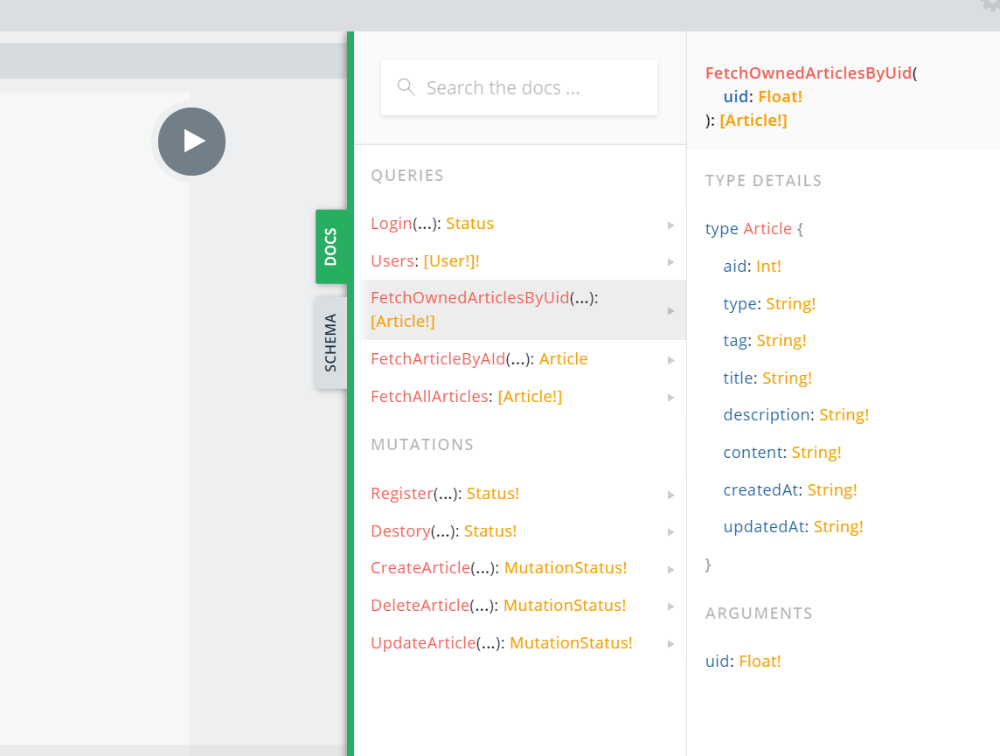

# Epoch-Server

Epoch API Server, built by `GraphQL` & `Apollo-Server-Koa`.

## Developing

It's only avaliable by using preset account for now, in the next stage you can create your own account and manage your own articles & blog configs.

By the way, You can check the api [here](http://47.97.183.158:4000/graphql), and read docs with it like this:

(you can also set the playground style as you wish like `dark mode`)

,

## Preset Account

Not Available Now, this server is not yet developed.

## Status

- [x] `TypeGraphQL` & `TypeORM`
- [x] Remove `Apollo-datasource`
- [x] Article API
- [x] User API
- [x] Config API
- [x] Validator(by `class-validator`)
- [ ] Typing Support
- [ ] Collect Fields By InputObjectType
  > need enable `Apollo-Client` to support it as well
- [ ] Authorization(JWT)

## Next Stage

In the next stage I will work forward making it a production ready cloud CMS like `Netify`.
